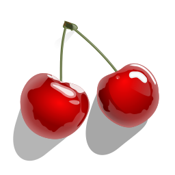

# :cherries: wildcherry


Another implementation of Word Count (`wc`), again.

## :speaking_head: Overview

This is another implementation of Word Count (`wc`).
I have already created alternatives of `wc`, named [`wildcat`](https://github.com/tamada/wildcat).
This repository is a separate implementation in the Go language, as an example in my course in the Graduate School.

## :runner: Usage

```sh
wildcherry [OPTION] <FILEs|DIRs|URLs...>
OPTION
    -b, --bytes          show the number of bytes.
    -c, --chars          show the number of characters.
    -l, --lines          show the number of lines.
    -w, --words          show the number of words.

        --log <LEVEL>    specify the log level (info, debug, warn, fatal)
    -h, --help           print this message.
```

## :smile: About

### :man_office_worker: Authors :woman_office_worker:

- [Haruaki Tamada](https://tamada.github.io/) [:octocat:](https://github.com/tamada)

### :jack_o_lantern: Icon



This SVG image is [Cherries](https://commons.wikimedia.org/wiki/File:TheStructorr_cherries.svg) by TheStructorr from [Wikimedia Commons](https://commons.wikimedia.org/wiki/Main_Page).